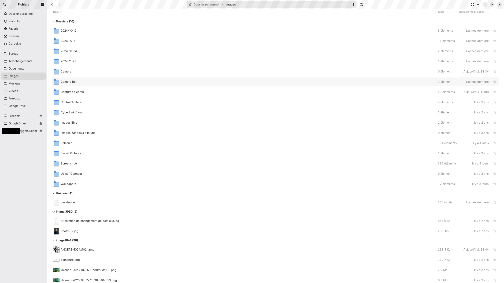
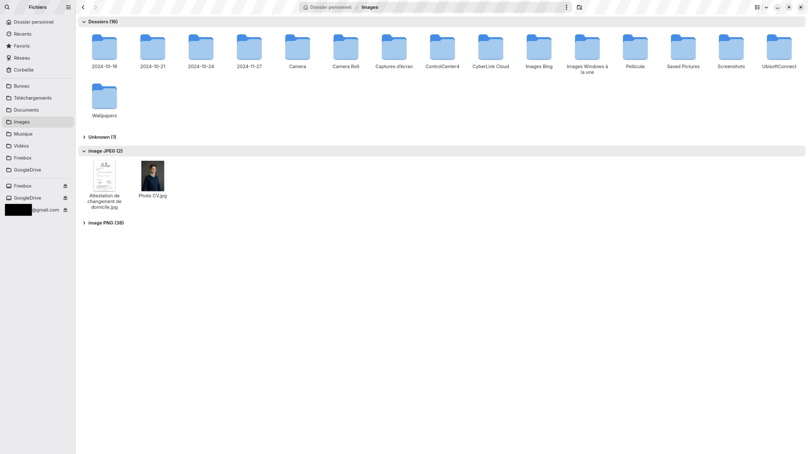

# Nautilus Collapsible Groups

Experimental prototype for **Nautilus 50.3** adding collapsible file-type grouping to both list and grid views.

> **Status:** Proof of concept / experimental  
> **Tested on:** Fedora 44, Nautilus 50.3, GTK 4.22  
> This is not an official GNOME or Nautilus release.

## Overview

This project explores a folder view where files can be grouped into collapsible sections while preserving Nautilus' normal sorting behavior inside each group.

The main use case is large mixed directories such as `Downloads`, where documents, images, videos, archives and other file types are otherwise displayed in one long flat view.

## Features

- Group files by type
- Collapsible and expandable group headers
- Normal Nautilus sorting preserved inside each group
- List view support
- Grid view support
- Collapsed state remembered per directory
- Collapsed state shared between list and grid views
- Separate experimental application ID
- Separate installation prefix
- Does not overwrite the system Nautilus installation

## Screenshots

### List view — expanded groups

### List view — collapsed groups

### Grid view

## Grid view implementation

A single flat `GtkGridView` cannot naturally guarantee that a new logical section starts on a new visual row.

The current prototype therefore uses a vertical collection of groups. Each expanded group displays its files using a `GtkFlowBox`.

Conceptually:

    Group A
    [ file ] [ file ] [ file ] [ file ]
    [ file ] [ file ]

    Group B
    [ file ] [ file ] [ file ]

    Group C
    [ file ] [ file ]

Each group wraps independently when the window is resized, and two different groups cannot share the same visual row.

## Persistence

The expanded/collapsed state is stored per directory using metadata specific to this experimental fork.

For example, `Downloads` can remember a different set of collapsed groups from `Documents`.

The experimental metadata and settings are kept separate from the system Nautilus configuration.

## Repository contents

- `nautilus-groupes.patch` — patch applied to Nautilus 50.3
- `installer.py` — build and installation helper
- `installer.sh` — installation entry point
- `desinstaller.sh` — uninstall helper
- `tests/` — regression tests
- `tools/` — reconstruction and development utilities
- `LIRE-MOI.md` — detailed usage notes
- `REPRISE.md` — development and recovery notes
- `screenshots/` — screenshots used for documentation

The full upstream Nautilus source tree is intentionally not committed to this repository.

## Installation

This prototype is primarily intended for testing on Fedora.

Clone the repository:

    git clone https://github.com/Jvia-code/nautilus-collapsible-groups.git
    cd nautilus-collapsible-groups

Then run:

    bash installer.sh

Do **not** run the installer itself with `sudo`.

The script requests elevated privileges only when required for Fedora build dependencies.

The experimental build is installed under a private user prefix and does not overwrite the distribution-provided Nautilus.

## Running

After installation:

    nautilus-groupes

## Uninstalling

    bash desinstaller.sh

## Current grouping strategy

The prototype currently uses relatively specific file-type / MIME-based groups.

This is useful for validating the technical model, but broader semantic categories may provide a better final user experience, for example:

- Folders
- Images
- Videos
- Audio
- PDF
- Documents
- Archives
- Other

## Possible future improvements

- Collapse all / Expand all
- Item counts in group headers
- Broader semantic file categories
- Additional grouping criteria
- Remember grouping mode per directory
- Further integration with Nautilus' native view architecture

## Development status

This project is a **proof of concept**, not an upstream-ready Nautilus patch.

Its purpose is to demonstrate the interaction model, test technical approaches and gather feedback from Nautilus / GNOME developers.

In particular, feedback would be useful regarding:

- whether collapsible grouping fits Nautilus' UX direction;
- whether grouping should be based on MIME types or broader semantic categories;
- where grouping should live in the Nautilus model/view architecture;
- what the preferred GTK architecture would be for sectioned grid layouts;
- whether per-directory persistence of collapsed groups is desirable.

## Releases

Packaged experimental snapshots are published through the GitHub **Releases** page.

The release archive contains the complete reproducible development package used for testing.

## License

Nautilus is distributed under the **GNU General Public License v3.0 or later**.

This repository contains modifications and patches derived from Nautilus source code and retains the corresponding licensing terms.

See [`COPYING`](COPYING).

## Disclaimer

This is an independent experimental prototype.

It is **not affiliated with, endorsed by, or distributed by the GNOME Project**.
